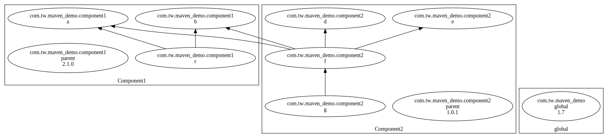

Proposal
--------

This covers some of the best practices that we have discussed.

1. All artifacts in a component have the same version number.
2. Parent versions are referenced by hard-coded versions
3. Only the parent pom of a component needs the version to be defined
4. Dependencies in the same component have the version defined as ${project.version}

Updated this to match.

**Issue**: Even if the parent version has been corrected, if one of the child POMs defines an older version maven will use that and not the parent pom without warning. This leads to issues in dependent builds. Maven Enforcer plugin does NOT enforce this.

Version Numbering
-----------------
	
Developers use the build part of the component for their local work. Build bumps the build part of the component. So integration builds and the corresponding versions in git that the dev would use:

* 1.1.0 - 1.1.0-1
* 1.2.0 - 1.2.0-1
* 1.3.0 - 1.3.0-1
* major bump
* 2.1.0 - 2.1.0-1
* 1.3 hotfix:
* 1.3.1 - 1.3.1-1

